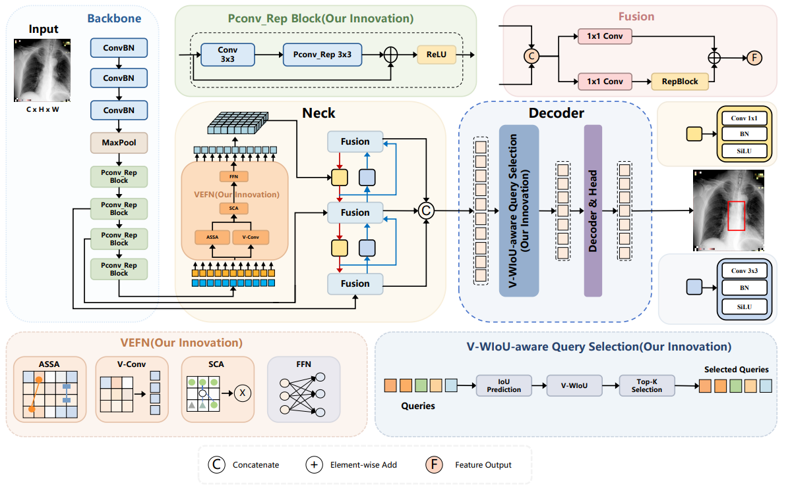
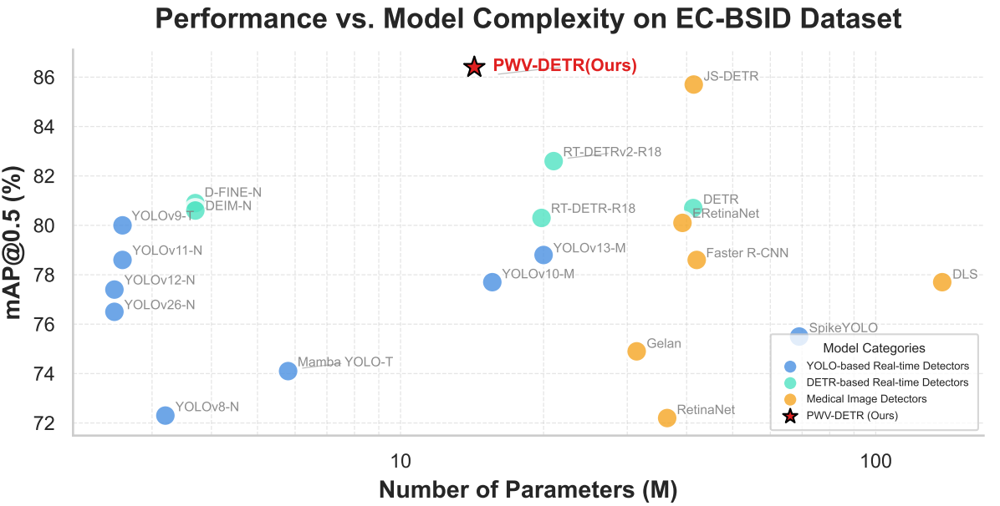

<p align="center">
  <h1 align="center">Longitudinal Structure-Aware Network for Esophageal Lesion Detection in Barium Esophagram</h1>
  <p align="center">
    <a href="#en">English</a> | <a href="#zh">中文</a>
  </p>
  <p align="center">
  <i>Hang He<sup>a</sup>, Peipei Zhang<sup>b</sup>, Xiangde Min<sup>b</sup>, Jing Peng<sup>a</sup>, Yaning Zhang<sup>a</sup>, Xueyuan Wen<sup>a</sup>, Shengzhou Xu<sup>a,*</sup></i>
  </p>
  <p align="center">
  <sup>a</sup>College of Computer Science, South-Central Minzu University; Key Laboratory of Cyber-Physical Fusion Intelligent Computing, State Ethnic Affairs Commission, Wuhan 430074, China<br>
  <sup>b</sup>Department of Radiology, Tongji Hospital, Tongji Medical College, Huazhong University of Science and Technology, Wuhan, 430030, China<br>
  </p>
</p>

---

<a id="zh"></a>

## Longitudinal Structure-Aware Network：基于纵向结构感知网络的钡餐食管病变检测

<p align="center">
  
</p>
<p align="center"><i>图 1：PWV-DETR 模型架构</i></p>

<p align="center">
  
</p>
<p align="center"><i>图 2：PWV-DETR 与其他主流检测模型的性能对比</i></p>

### 概述

PWV-DETR 是一种基于 Ultralytics RT-DETR 框架改进的食管钡餐影像病变检测模型。模型名称 **PWV** 由三个核心创新模块的首字母组成：

| 模块 | 全称 | 作用 |
|:----:|------|------|
| **P** | PConv-Rep Block | 骨干网络中的部分卷积重参数化块，降低背景区域的计算冗余 |
| **V** | VEFN (Vertical-Enhanced Feature Network) | 垂直增强特征融合网络，利用垂直卷积和通道注意力增强食管纵向形态特征的提取 |
| **W** | V-WIoU (Vertical-wise Intersection over Union) | 垂直结构一致性损失函数，引入可学习纵横比阈值 τ 和形态惩罚因子 Ω<sub>v</sub>，抑制不符合食管纵向解剖先验的梯度 |

### 项目结构

```
PWV-DETR/
├── ultralytics/
│   ├── cfg/
│   │   └── models/
│   │       ├── PWV.yaml          # PWV-DETR 模型配置
│   │       └── Baseline.yaml     # 基线 RT-DETR 配置
│   ├── nn/
│   │   ├── extra_modules/
│   │   │   ├── transformer.py   # VEFN (TransformerEncoderLayer_VEFN) 实现
│   │   │   ├── block.py         # PConv-Rep (BasicBlock_PConv_Rep) 实现
│   │   │   └── attention.py      # 自适应稀疏注意力 (ASSA) 实现
│   │   ├── modules/
│   │   │   ├── block.py         # 基础模块 (RepC3, Bottleneck, etc.)
│   │   │   ├── conv.py          # 卷积模块
│   │   │   ├── head.py          # 检测头
│   │   │   └── transformer.py   # Transformer 解码器
│   │   └── tasks.py             # 模型构建与注册
│   ├── models/
│   │   └── utils/
│   │       ├── loss.py          # RT-DETR 损失函数 (集成 V-WIoU)
│   │       └── esophageal_loss.py # 食管癌感知辅助损失
│   └── utils/
│       └── metrics.py           # V-WIoU 损失核心实现 (WiseIouLoss)
├── dataset/
│   ├── mydata.yaml              # 数据集配置
│   ├── xml2txt.py               # VOC XML -> YOLO TXT 格式转换
│   ├── split_data.py            # 数据集划分 (train/val/test)
│   └── yolo2coco.py             # YOLO -> COCO 格式转换
├── figures/
│   ├── Figure1.png              # 模型架构图
│   └── Figure2.png              # 模型对比图
├── train.py                     # 训练入口
├── detect.py                    # 推理入口
├── export.py                    # 模型导出 (ONNX 等)
├── heatmap.py                   # Grad-CAM 热力图可视化
├── get_COCO_metrice.py          # COCO 指标评估及 TIDE 分析
├── get_FPS.py                   # FPS 推理速度测试
├── get_model_erf.py             # 有效感受野可视化
├── requirements.txt              # 依赖列表
└── setup.py                     # 安装脚本
```

### 环境要求

- Python >= 3.8
- PyTorch >= 1.8.0
- torchvision >= 0.9.0
- CUDA (GPU 训练推荐)

### 安装

```bash
# 克隆项目
git clone https://github.com/valueyou24/PWV-DETR.git
cd PWV-DETR

# 安装依赖
pip install -r requirements.txt

# 可选：安装项目为可编辑包
pip install -e .
```

### 数据准备

项目使用 YOLO 格式数据集，目录结构如下：

```
dataset/
└── mydata/
    ├── images/
    │   ├── train/    # 训练集图像
    │   ├── val/      # 验证集图像
    │   └── test/     # 测试集图像
    └── labels/
        ├── train/    # 训练集标注 (YOLO TXT)
        ├── val/      # 验证集标注
        └── test/     # 测试集标注
```

如果你的数据为 VOC (XML) 格式，可按以下步骤转换：

```bash
cd dataset

# 1. 将 VOC XML 标注转换为 YOLO TXT 格式
python xml2txt.py

# 2. 划分训练/验证/测试集 (默认比例 7:1:2)
python split_data.py

# 3. (可选) 转换为 COCO JSON 格式
python yolo2coco.py
```

修改 `dataset/mydata.yaml` 中的路径以指向你的数据集目录。

### 训练

```bash
python train.py
```

训练参数可在 `train.py` 中调整，默认配置如下：

| 参数 | 默认值 | 说明 |
|:-----:|:------:|------|
| `model` | `ultralytics/cfg/models/PWV.yaml` | 模型配置文件 |
| `data` | `dataset/mydata.yaml` | 数据集配置 |
| `imgsz` | 640 | 输入图像尺寸 |
| `epochs` | 100 | 训练轮数 |
| `batch` | 4 | 批大小 (Windows 建议设为 4) |
| `patience` | 20 | 早停轮数 (20 轮无提升则停止) |
| `workers` | 0 | 数据加载线程数 (Windows 建议设为 0) |

### 推理

```bash
python detect.py
```

在 `detect.py` 中修改 `model` 参数指向你的训练权重路径（如 `runs/train/pwv-detr/weights/best.pt`），并修改 `source` 指向待推理图像或目录。

### 模型导出

```bash
python export.py
```

支持导出为 ONNX、TensorRT、CoreML 等格式，在 `export.py` 中设置 `format` 参数即可。

### 关键模块说明

<details>
<summary><b>1. PConv-Rep Block (骨干网络增强)</b></summary>

PConv-Rep Block 将部分卷积 (Partial Conv, PConv) 与重参数化卷积 (RepConv) 结合，替代骨干网络 BasicBlock 中的标准 3x3 卷积。

- **PConv** 仅对输入通道的一部分进行卷积计算，大幅减少背景区域特征提取的计算量
- **RepConv** 在推理阶段将多分支卷积融合为单个卷积，零额外推理开销
- 定义于 `ultralytics/nn/extra_modules/block.py` 中的 `BasicBlock_PConv_Rep`

</details>

<details>
<summary><b>2. VEFN (垂直增强特征融合网络)</b></summary>

VEFN (Vertical-Enhanced Feature Network) 替代 RT-DETR 颈部 (Neck) 中的标准 AIFI 模块，通过以下机制增强食管纵向形态特征的提取：

- **自适应稀疏自注意力 (ASSA)**：在全局感受野上捕获病灶区域的语义信息
- **垂直卷积 (Vertical Conv)**：5x1 深度可分离卷积，显式增强垂直方向的边缘和纹理特征
- **通道注意力 (Channel Attention)**：轻量级 SE 模块进行通道重标定

定义于 `ultralytics/nn/extra_modules/transformer.py` 中的 `TransformerEncoderLayer_VEFN`

</details>

<details>
<summary><b>3. V-WIoU (垂直结构一致性损失)</b></summary>

V-WIoU 在 Wise-IoU V3 的非单调动态聚焦机制基础上，引入垂直结构一致性因子 Ω<sub>v</sub>：

<p align="center"></p>

- **τ (tau)**：可学习的纵横比阈值，初始化为 0.98，训练中自适应收敛至与食管病灶形态匹配的值
- **μ (mu)**：形态惩罚缩放系数，控制对偏离纵向先验的预测框的梯度抑制强度
- **Ω<sub>v</sub>**：当预测框纵横比偏离食管纵向先验时，降低其损失权重，抑制有害梯度

定义于 `ultralytics/utils/metrics.py` 中的 `WiseIouLoss` 类

</details>

### Baseline 与 PWV-DETR 的对比

`ultralytics/cfg/models/` 下提供了两个配置文件：

- **Baseline.yaml**：标准 RT-DETR (BasicBlock + AIFI + GIoU)
- **PWV.yaml**：PWV-DETR (BasicBlock_PConv_Rep + VEFN + V-WIoU)

通过对比两个配置可以快速验证各模块的贡献。

### 可视化工具

| 脚本 | 功能 | 依赖 |
|:-----|------|------|
| `heatmap.py` | Grad-CAM 特征图可视化 | pytorch-grad-cam |
| `get_model_erf.py` | 有效感受野 (ERF) 可视化 | — |
| `get_FPS.py` | 推理速度 (FPS) 测试 | — |
| `get_COCO_metrice.py` | COCO mAP 评估及 TIDE 错误分析 | pycocotools, tidecv |

### 致谢

本项目受到以下基金资助：

本研究由中央高校基本科研业务费专项资金（中南民族大学）（CZZ25005）和湖北省自然科学基金（2025AFB688）资助。

本项目基于以下开源工作进行改进：

- [Ultralytics YOLOv8](https://github.com/ultralytics/ultralytics) — 训练框架
- [RT-DETR](https://arxiv.org/abs/2304.08069) — 实时检测 Transformer 架构
- [Wise-IoU](https://arxiv.org/abs/2301.10051) — 动态非单调聚焦 IoU 损失
- [PConv](https://arxiv.org/abs/2303.03852) — FasterNet 中的部分卷积
- [RepVGG](https://arxiv.org/abs/2101.03697) — 重参数化卷积

### 引用

如果本项目对你有帮助，请引用：

```bibtex
@article{he2025longitudinal,
  title={Longitudinal Structure-Aware Network for Esophageal Lesion Detection in Barium Esophagram},
  author={He, Hang and Peng, Jing and Zhang, Yaning and Wen, Xueyuan and Min, Xiangde and Xu, Shengzhou},
  journal={},
  year={2025}
}
```

---

<a id="en"></a>

## Longitudinal Structure-Aware Network for Esophageal Lesion Detection in Barium Esophagram

<p align="center">
  <i>Hang He<sup>a</sup>, Peipei Zhang<sup>b</sup>, Xiangde Min<sup>b</sup>, Jing Peng<sup>a</sup>, Yaning Zhang<sup>a</sup>, Xueyuan Wen<sup>a</sup>, Shengzhou Xu<sup>a,*</sup></i>
  </p>
  <p align="center">
  <sup>a</sup>College of Computer Science, South-Central Minzu University; Key Laboratory of Cyber-Physical Fusion Intelligent Computing, State Ethnic Affairs Commission, Wuhan 430074, China<br>
  <sup>b</sup>Department of Radiology, Tongji Hospital, Tongji Medical College, Huazhong University of Science and Technology, Wuhan, 430030, China<br>
  </p>

<p align="center">
  
</p>
<p align="center"><i>Figure 1: Architecture of PWV-DETR</i></p>

<p align="center">
  
</p>
<p align="center"><i>Figure 2: Performance comparison of PWV-DETR with other mainstream detectors</i></p>

### Overview

PWV-DETR is an improved esophageal lesion detection model based on the Ultralytics RT-DETR framework. The name **PWV** stands for three core innovations:

| Module | Full Name | Role |
|:------:|----------|------|
| **P** | PConv-Rep Block | Partial convolution with re-parameterization in the backbone, reducing computational redundancy in background regions |
| **V** | VEFN (Vertical-Enhanced Feature Network) | Vertical-enhanced feature fusion network leveraging vertical convolution and channel attention to strengthen longitudinal morphological feature extraction of the esophagus |
| **W** | V-WIoU (Vertical-wise Intersection over Union) | Vertical structure conformity loss introducing a learnable aspect ratio threshold τ and morphological penalty factor Ω<sub>v</sub> to suppress gradients from predictions deviating from the longitudinal esophageal prior |

### Project Structure

```
PWV-DETR/
├── ultralytics/
│   ├── cfg/
│   │   └── models/
│   │       ├── PWV.yaml          # PWV-DETR model configuration
│   │       └── Baseline.yaml     # Baseline RT-DETR configuration
│   ├── nn/
│   │   ├── extra_modules/
│   │   │   ├── transformer.py   # VEFN (TransformerEncoderLayer_VEFN) implementation
│   │   │   ├── block.py         # PConv-Rep (BasicBlock_PConv_Rep) implementation
│   │   │   └── attention.py      # Adaptive Sparse Self-Attention (ASSA) implementation
│   │   ├── modules/
│   │   │   ├── block.py         # Base modules (RepC3, Bottleneck, etc.)
│   │   │   ├── conv.py          # Convolution modules
│   │   │   ├── head.py          # Detection head
│   │   │   └── transformer.py   # Transformer decoder
│   │   └── tasks.py             # Model construction and registry
│   ├── models/
│   │   └── utils/
│   │       ├── loss.py          # RT-DETR loss (with V-WIoU integration)
│   │       └── esophageal_loss.py # Esophageal-aware auxiliary loss
│   └── utils/
│       └── metrics.py           # V-WIoU core implementation (WiseIouLoss)
├── dataset/
│   ├── mydata.yaml              # Dataset configuration
│   ├── xml2txt.py               # VOC XML -> YOLO TXT format conversion
│   ├── split_data.py            # Dataset splitting (train/val/test)
│   └── yolo2coco.py             # YOLO -> COCO format conversion
├── figures/
│   ├── Figure1.png              # Model architecture
│   └── Figure2.png              # Model comparison
├── train.py                     # Training entry point
├── detect.py                    # Inference entry point
├── export.py                    # Model export (ONNX, etc.)
├── heatmap.py                   # Grad-CAM heatmap visualization
├── get_COCO_metrice.py          # COCO metric evaluation and TIDE analysis
├── get_FPS.py                   # FPS inference speed benchmark
├── get_model_erf.py             # Effective receptive field visualization
├── requirements.txt              # Dependencies
└── setup.py                     # Installation script
```

### Requirements

- Python >= 3.8
- PyTorch >= 1.8.0
- torchvision >= 0.9.0
- CUDA (recommended for GPU training)

### Installation

```bash
# Clone the repository
git clone https://github.com/valueyou24/PWV-DETR.git
cd PWV-DETR

# Install dependencies
pip install -r requirements.txt

# Optional: install as editable package
pip install -e .
```

### Data Preparation

The project uses YOLO format datasets with the following directory structure:

```
dataset/
└── mydata/
    ├── images/
    │   ├── train/    # Training images
    │   ├── val/      # Validation images
    │   └── test/     # Test images
    └── labels/
        ├── train/    # Training labels (YOLO TXT)
        ├── val/      # Validation labels
        └── test/     # Test labels
```

If your annotations are in VOC (XML) format, convert them as follows:

```bash
cd dataset

# 1. Convert VOC XML annotations to YOLO TXT format
python xml2txt.py

# 2. Split into train/val/test sets (default ratio 7:1:2)
python split_data.py

# 3. (Optional) Convert to COCO JSON format
python yolo2coco.py
```

Update the paths in `dataset/mydata.yaml` to point to your dataset directory.

### Training

```bash
python train.py
```

Training parameters can be adjusted in `train.py`. Default configuration:

| Parameter | Default | Description |
|:---------:|:-------:|-------------|
| `model` | `ultralytics/cfg/models/PWV.yaml` | Model configuration file |
| `data` | `dataset/mydata.yaml` | Dataset configuration |
| `imgsz` | 640 | Input image size |
| `epochs` | 100 | Number of training epochs |
| `batch` | 4 | Batch size (recommended 4 for Windows) |
| `patience` | 20 | Early stopping patience |
| `workers` | 0 | Data loading workers (recommended 0 for Windows) |

### Inference

```bash
python detect.py
```

Modify the `model` parameter in `detect.py` to point to your trained weights (e.g., `runs/train/pwv-detr/weights/best.pt`), and set `source` to the image or directory you want to run inference on.

### Model Export

```bash
python export.py
```

Supports exporting to ONNX, TensorRT, CoreML, and other formats. Set the `format` parameter in `export.py`.

### Key Modules

<details>
<summary><b>1. PConv-Rep Block (Backbone Enhancement)</b></summary>

PConv-Rep Block combines Partial Convolution (PConv) with Re-parameterized Convolution (RepConv), replacing the standard 3x3 convolution in the backbone BasicBlock.

- **PConv** performs convolution only on a fraction of input channels, significantly reducing computational cost for background feature extraction
- **RepConv** fuses multi-branch convolutions into a single convolution at inference time with zero additional overhead
- Defined as `BasicBlock_PConv_Rep` in `ultralytics/nn/extra_modules/block.py`

</details>

<details>
<summary><b>2. VEFN (Vertical-Enhanced Feature Network)</b></summary>

VEFN replaces the standard AIFI module in the RT-DETR neck, enhancing the extraction of longitudinal esophageal morphological features through:

- **Adaptive Sparse Self-Attention (ASSA)**: Captures semantic information of lesion regions with a global receptive field
- **Vertical Convolution**: 5x1 depth-wise separable convolution that explicitly enhances vertical edge and texture features
- **Channel Attention**: Lightweight SE module for channel recalibration

Defined as `TransformerEncoderLayer_VEFN` in `ultralytics/nn/extra_modules/transformer.py`

</details>

<details>
<summary><b>3. V-WIoU (Vertical Structure Conformity Loss)</b></summary>

V-WIoU extends the Wise-IoU V3 non-monotonic dynamic focusing mechanism with a vertical structure conformity factor Ω<sub>v</sub>:

<p align="center"></p>

- **τ (tau)**: Learnable aspect ratio threshold, initialized at 0.98, adaptively converging to match esophageal lesion morphology during training
- **μ (mu)**: Morphological penalty scaling coefficient controlling gradient suppression strength for predictions deviating from the vertical prior
- **Ω<sub>v</sub>**: Reduces the loss weight when the predicted box aspect ratio deviates from the esophageal longitudinal prior, suppressing harmful gradients

Defined as `WiseIouLoss` in `ultralytics/utils/metrics.py`

</details>

### Baseline vs. PWV-DETR

Two configuration files are provided under `ultralytics/cfg/models/`:

- **Baseline.yaml**: Standard RT-DETR (BasicBlock + AIFI + GIoU)
- **PWV.yaml**: PWV-DETR (BasicBlock_PConv_Rep + VEFN + V-WIoU)

Comparing these two configurations allows quick validation of each module's contribution.

### Visualization Tools

| Script | Function | Dependencies |
|:-------|----------|:------------|
| `heatmap.py` | Grad-CAM feature map visualization | pytorch-grad-cam |
| `get_model_erf.py` | Effective Receptive Field (ERF) visualization | — |
| `get_FPS.py` | Inference speed (FPS) benchmark | — |
| `get_COCO_metrice.py` | COCO mAP evaluation and TIDE error analysis | pycocotools, tidecv |

### Acknowledgements

This work was supported by the Fundamental Research Funds for the Central Universities of South-Central Minzu University (CZZ25005) and the Natural Science Foundation of Hubei Province (2025AFB688).

This project builds upon the following open-source works:

- [Ultralytics YOLOv8](https://github.com/ultralytics/ultralytics) — Training framework
- [RT-DETR](https://arxiv.org/abs/2304.08069) — Real-time detection Transformer architecture
- [Wise-IoU](https://arxiv.org/abs/2301.10051) — Dynamic non-monotonic focusing IoU loss
- [PConv](https://arxiv.org/abs/2303.03852) — Partial convolution from FasterNet
- [RepVGG](https://arxiv.org/abs/2101.03697) — Re-parameterized convolution

### Citation

If you find this project helpful, please cite:

```bibtex
@article{he2025longitudinal,
  title={Longitudinal Structure-Aware Network for Esophageal Lesion Detection in Barium Esophagram},
  author={He, Hang and Peng, Jing and Zhang, Yaning and Wen, Xueyuan and Min, Xiangde and Xu, Shengzhou},
  journal={},
  year={2025}
}
```
